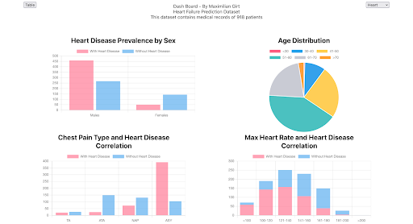
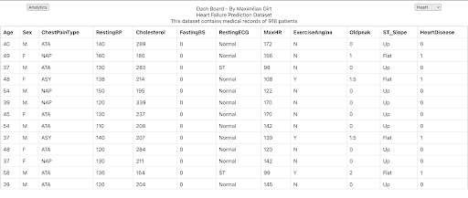

# About the project #

1. The application aims to display data on a dashboard showing various analytics in the forms of charts and tables. It has the ability to switch between various data sets as well. The application focuses on Heart Disease, Stroke, and Diabetes and uses three separate datasets to achieve this. The reason for focusing on these three illnesses is that they are inherently linked as people at risk of one are also at risk of the other two.
2. The application utilises the cloud via Amazon AWS’s EC2 to host the website. Nginx is used to allow connections from outside the ec2. Tmux is used to keep the website running even when I am not SSH into the ec2.
3. The data warehouse is hosted via Amazon AWS RedShift. RedShift has tables for each data set. The tables are saved in the default dev/public schema.
4. RedShift retrieves the data from an Amazon S3 Bucket. This bucket is used to store the csv files from kaggle.

# How to run the project #

1. CD into the  base project folder
2. turn on docker desktop
3. docker-compose up
4. Open browser and go to localhost

Please note that you need a valid AWS account setup with the data warehouse and S3 bucket set up with the data from kaggle. You will also need the correct permissions setup. This is all outlined in the Project PDF. 